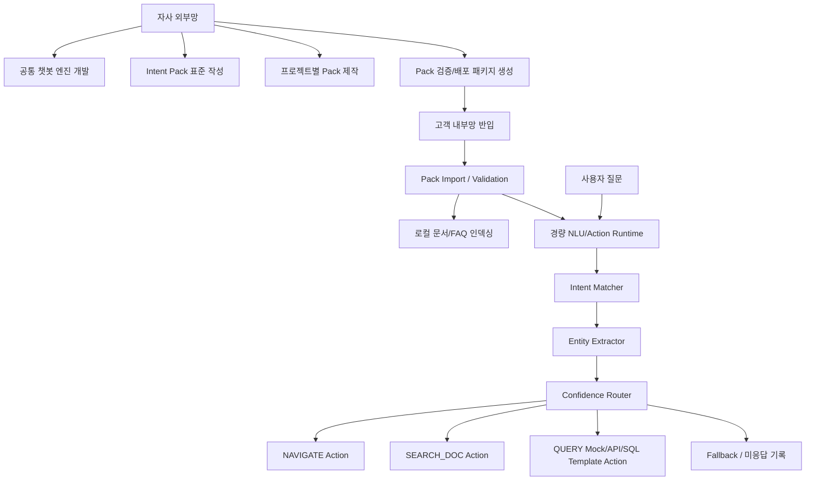

# 14. 대표님 보고용 기획안

## 1. 보고 목적

본 문서는 대표님 지시사항인 "고객 내부망 환경에서도 챗봇 기능을 제공할 수 있는 방안"에 대해, 단일 서비스 챗봇이 아닌 자사 프로젝트 전반에 재사용 가능한 공통 챗봇 적용 방안을 정리하기 위한 보고용 기획안이다.

핵심 방향은 다음과 같다.

```text
자사 외부망에서는 공통 챗봇 엔진, Intent Pack 표준, 배포 패키지를 준비하고,
고객 내부망에서는 고객 데이터와 문서를 로컬 인덱싱하여
외부 LLM 없이 경량 NLU/검색/Action Runtime으로 챗봇 기능을 제공한다.
```

## 2. 배경

고객사는 내부망 또는 폐쇄망 환경에서 서비스를 운영하는 경우가 많다. 이 환경에서는 외부 LLM API, 외부 클라우드 검색 API, 실시간 인터넷 연동을 전제로 한 챗봇 도입이 어렵다.

기존 GraphRAG 기반 챗봇 접근은 지식 검색과 답변 생성 측면에서 장점이 있으나, 대표님 지시사항의 핵심은 "무거운 생성형 LLM을 운영망에 붙이는 것"이 아니라 "고객망 제약을 지키면서 자연어 기반 업무 UX를 제공하는 것"이다.

따라서 본 프로젝트는 다음 방향으로 전환한다.

1. 생성형 LLM 중심 챗봇이 아니라 Lightweight NLU + Action 기반 챗봇으로 접근한다.
2. 서비스별 질문, 화면, 문서, API, SQL Template은 Intent Pack으로 분리한다.
3. 고객 데이터는 고객망 밖으로 반출하지 않는다.
4. 자사는 공통 엔진과 Pack 표준, 검증 도구, 배포 패키지를 준비한다.
5. 탄소중립플랫폼은 1차 파일럿으로 사용하되, 최종 목표는 모든 자사 프로젝트로 확장 가능한 구조다.

## 3. 문제 정의

### 3.1 고객 환경 문제

| 문제 | 설명 |
|---|---|
| 외부 LLM 연동 제한 | 내부망/폐쇄망에서는 OpenAI, Azure OpenAI, Gemini 등 외부 API 사용이 어렵다. |
| 보안 검토 부담 | 고객 데이터가 외부로 나가는 구조는 보안 심사와 고객 승인 리스크가 크다. |
| GPU/LLM 운영 부담 | On-Prem LLM은 인프라, 모델 관리, 성능 튜닝, 비용 부담이 크다. |
| 환각 리스크 | 생성형 답변은 업무 수치, 정책, 절차에서 틀린 답변을 만들 수 있다. |
| 프로젝트별 재개발 | 서비스마다 별도 챗봇을 만들면 유지보수와 확장성이 낮다. |

### 3.2 우리가 풀 문제

```text
고객 내부망 제약을 지키면서,
자사 여러 프로젝트에 반복 적용 가능한
공통 챗봇 실행 구조와 서비스별 설정 패키지 체계를 만든다.
```

## 4. 목표

### 4.1 최종 목표

자사 프로젝트 전반에 재사용 가능한 폐쇄망 대응형 공통 챗봇 프레임워크를 구축한다.

### 4.2 7월 중순 시연 목표

2026년 7월 중순까지 C-lite MVP를 개발하여 대표님께 시연한다.

C-lite MVP 범위는 다음과 같다.

| 구분 | 범위 | 시연 기준 |
|---|---|---|
| A. 화면/기능 이동 | 자연어 질문을 서비스 화면/메뉴 이동 Action으로 연결 | "인덱싱 작업 현황 열어줘" → 화면 이동 카드 |
| C. 문서/FAQ/자료실 검색 | 문서, FAQ, 매뉴얼을 로컬 인덱싱하고 근거 문단 검색 | "Scope 2 기준 알려줘" → 근거 문단 반환 |
| B 일부. 정형 조회 | 사전 정의된 Mock/API/SQL Template Action만 제한 실행 | "등록된 프로젝트 수 알려줘" → 카드 응답 |

## 5. 제안 아키텍처



## 6. 공통화 전략

| 영역 | 공통 플랫폼 | 서비스별 Pack |
|---|---|---|
| 질문 전처리 | Query Preprocessor | 불용어/동의어 보강 |
| Intent 매칭 | Matcher Engine | Intent 목록, 예시 질문 |
| Entity 추출 | Extractor Framework | Entity Dictionary, Synonym |
| Action 실행 | Action Runtime | Action Registry, API/SQL/Route |
| 문서 검색 | Search Runtime | FAQ, 매뉴얼, 자료실 인덱스 |
| 운영 관리 | Pack Import, Validation, Rollback | Pack Version, Manifest |
| 테스트 | Validation Runner | 프로젝트별 검증 질문셋 |

## 7. 탄소중립플랫폼 파일럿 적용

탄소중립플랫폼은 1차 파일럿으로 사용한다. 공식 소개 페이지 기준으로 다음 영역을 예시 범위로 삼을 수 있다.

| 서비스 영역 | 챗봇 적용 예시 |
|---|---|
| 플랫폼 소개 | "탄소중립플랫폼이 뭐야?" |
| 재생에너지 직접공급관리 | "재생에너지 직접공급관리 화면 열어줘" |
| 상쇄거래 외부사업관리 | "상쇄거래 외부사업관리 설명 찾아줘" |
| 온실가스 인벤토리관리 | "온실가스 인벤토리 관리 방법 알려줘" |
| 서비스 신청 | "서비스 신청 현황 조회 화면으로 가줘" |
| FAQ/자료실 | "배출량 산정 기준 관련 FAQ 찾아줘" |

## 8. 1차 MVP 제외 범위

| 제외 범위 | 제외 사유 |
|---|---|
| 자유 자연어 SQL 생성 | SQL Injection, 권한 우회, 오답 리스크 |
| 외부 LLM API 호출 | 내부망/폐쇄망 대응 원칙과 충돌 |
| 고객 운영 DB 직접 연결 전체 범위 | 프로젝트별 권한/스키마/성능 확인 필요 |
| 등록/수정/삭제 Action | 변경성 업무로 승인/감사 정책 필요 |
| 다운로드 Action 전체 구현 | 파일 권한, 마스킹, 보관 정책 필요 |
| 모든 프로젝트 Pack 완성 | 1차는 공통 구조와 탄소중립 파일럿 검증이 목적 |

## 9. 기대 효과

| 효과 | 설명 |
|---|---|
| 내부망 대응 | 고객 데이터가 고객망 밖으로 나가지 않는다. |
| 비용 절감 | 외부 LLM API와 GPU 서버 없이 CPU 기반 경량 실행이 가능하다. |
| 환각 방지 | 승인된 Intent, Action, 문서 검색, SQL Template만 실행한다. |
| 재사용성 | 프로젝트별 Pack만 교체하여 여러 서비스에 적용할 수 있다. |
| 운영 통제 | 미응답 질문, Confidence, Action 로그를 운영 개선에 활용한다. |
| 빠른 시연 | 화면 이동, 문서 검색, 제한 조회 중심으로 7월 중순 시연이 가능하다. |

## 10. 대표님 보고 메시지

```text
본 프로젝트는 탄소중립플랫폼 단일 챗봇이 아니라,
자사 프로젝트 전반에 재사용 가능한 폐쇄망 대응형 공통 챗봇 프레임워크입니다.

1차 시연은 탄소중립플랫폼을 파일럿으로 하되,
핵심은 서비스별 Intent Pack을 교체하여 다른 프로젝트에도 확장 가능한 구조를 검증하는 것입니다.

고객 데이터는 고객 내부망에서만 로컬 인덱싱하며,
운영망에서는 외부 LLM 없이 화면 이동, 문서 검색, 제한된 정형 조회 Action을 수행합니다.
```

## 11. 다음 의사결정

| 항목 | 결정 필요 |
|---|---|
| 시연 일자 | 2026년 7월 중순 기준 정확한 보고/시연일 확정 |
| 시연 서비스 | 탄소중립플랫폼 파일럿 기준 확정 |
| 시연 질문 | 화면 이동 5개, 문서 검색 5개, Mock 조회 3개 선정 |
| 정형 조회 범위 | Mock만 할지, 일부 실제 시스템 통계 API를 붙일지 결정 |
| 보고 산출물 | 기획안, 시연 시나리오, 개발 스프린트 계획을 대표님 보고 세트로 사용 |
