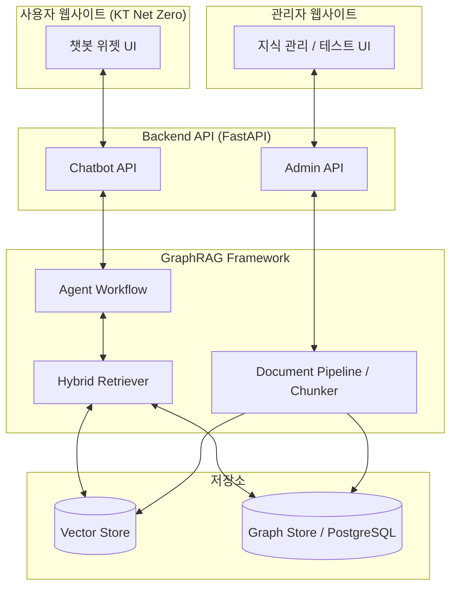

# 탄소 중립플랫폼 챗봇 개발 프로젝트 계획서

## 1. 프로젝트 개요

### 1.1 프로젝트명
KT 탄소 중립플랫폼(KT Net Zero) 지능형 챗봇 구축 프로젝트

### 1.2 추진 배경
KT 탄소 중립플랫폼(`https://ktnetzero.kt.co.kr/`) 사용자들에게 탄소 배출, 감축, 관련 법규 등 다양하고 전문적인 탄소 중립 지식을 쉽게 제공하기 위해, **GraphRAG 기반의 지능형 챗봇**을 도입하고자 합니다. 기존 구축된 `GraphRAG-AI-Agent` 공통 프레임워크를 바탕으로, 탄소 도메인에 특화된 지식 검색 및 답변 생성 기능을 구축하여 플랫폼의 활용성을 높이는 것이 목표입니다.

### 1.3 프로젝트 목표

| 구분 | 목표 | 주요 결과물 |
| --- | --- | --- |
| **사용자 사이트** | `https://ktnetzero.kt.co.kr/` 내 챗봇 창 제공 | 챗봇 위젯, 질의응답 API, 대화 이력 관리, 출처(Evidence) 기반 답변 |
| **관리자 사이트** | 챗봇 지식/운영 관리 기능 제공 | 지식(Source) 등록, 인덱싱 관리, 답변 테스트 환경, 로그/통계, 프롬프트 관리 |

---

## 2. 프로젝트 범위

### 2.1 GraphRAG AI Agent 프레임워크 확장 (탄소 도메인 특화)
- 탄소 중립 도메인(법규, 배출권, 프로젝트 등) 맞춤형 Entity 및 Relation 정의(`SchemaRegistry` 확장)
- 문서 로딩, 텍스트 정규화 및 탄소 관련 데이터 파싱 로직(`ParserRegistry`) 강화
- Vector Store와 Graph Store(Entity/Relation 저장) 연동 확장

### 2.2 사용자 사이트 (Front-Office)
- **챗봇 위젯 UI**: 사용자 웹사이트 우측 하단 등에 배치될 대화형 인터페이스 구축 (기존 플랫폼 연동)
- **질의응답 API**: 사용자의 질문을 받아 GraphRAG 파이프라인(`HybridRetriever` + `LLMAnswerNode`)을 거쳐 답변과 출처를 반환하는 엔드포인트 제공
- **대화 이력 관리**: 사용자별 세션 및 과거 질문 내역 저장/조회 기능

### 2.3 관리자 사이트 (Back-Office)
- **지식 및 인덱싱 관리**: PDF, 텍스트 등 탄소 관련 정책/지식 문서를 업로드하고 청킹 및 임베딩을 수행하는 UI 및 API
- **테스트 및 프롬프트 관리**: 관리자가 질의를 테스트해보고, 답변 생성에 쓰이는 LLM 시스템 프롬프트를 수정할 수 있는 기능
- **로그 및 통계**: 챗봇 사용량, 주요 질의어, 검색 실패/오류 로그 모니터링 기능

### 2.4 제외 범위
- `ktnetzero.kt.co.kr` 플랫폼 자체의 핵심 비즈니스 로직(탄소 배출량 계산 등) 변경
- 챗봇 외의 프론트엔드/백엔드 대규모 마이그레이션

---

## 3. 목표 아키텍처 (Conceptual)

---

## 4. 단계별 추진 계획

본 프로젝트는 공식 산출물 체계에 맞춰 아래 5단계로 진행됩니다.

1. **계획 (100.프로젝트계획)**: 프로젝트 범위 설정, WBS 확정 (현재 단계)
2. **아키텍처/요구정의 (210~220)**: 상세 아키텍처 수립 및 기능/비기능 요구사항 정의
3. **분석/설계 (230~240)**: 탄소 중립 도메인 지식 설계, API 명세, DB 설계
4. **구현/테스트 (250~260)**: 프레임워크 확장 개발, 챗봇 위젯 연동, 단위/통합 테스트
5. **이행/종료 (270~300)**: 사용자/관리자 매뉴얼 작성, 최종 파일럿 검증 및 완료 보고

*(상세 일정은 동봉된 WBS 문서를 참조)*

---

## 5. 역할 및 책임 (R&R)

- **PM / 아키텍트**: 일정 관리, 아키텍처 설계, 산출물 검토
- **AI/Backend 엔지니어 (Agent)**: GraphRAG 프레임워크 커스텀, FastAPI 기반 API 개발, LLM 프롬프트 설계
- **Frontend 엔지니어**: KT Net Zero 플랫폼 내 챗봇 위젯 통합, 관리자 화면 UI 수정/개발

---

## 6. 품질 및 위험 관리

- **품질**: 챗봇 답변은 반드시 사전에 인덱싱된 "출처(Evidence)"를 기반으로 제공해야 하며(할루시네이션 방지), LLM 시스템 프롬프트를 통해 탄소 도메인 외의 질문은 답변을 거절하도록 통제합니다.
- **위험**: 
  - *LLM 응답 지연*: 하이브리드 검색 및 LLM 생성 최적화. 위젯 UI에서 타이핑 효과 등을 통해 체감 대기 시간 감소.
  - *문서 파싱 품질 저하*: 탄소 정책 관련 PDF 양식의 다양성을 고려하여, 파서 정규화 로직 사전 검증 및 고도화.
