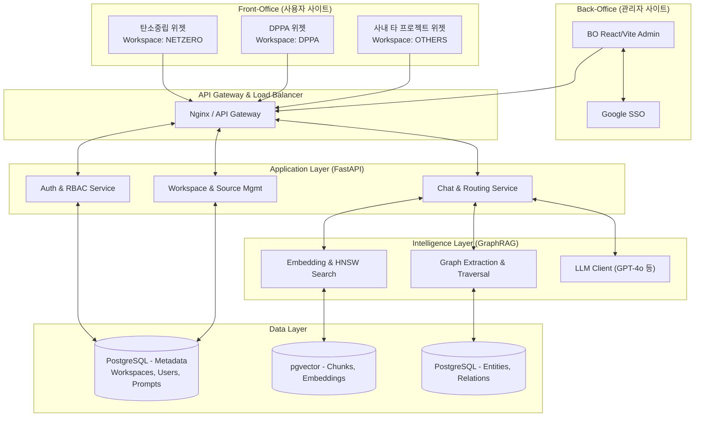

# 02. TO-BE 아키텍처 정의서

## 1. 문서 개요
| 항목 | 내용 |
|---|---|
| 문서명 | TO-BE 아키텍처 정의서 (사내 멀티 프로젝트 지식 챗봇 플랫폼) |
| 작성일 | 2026-06-22 |
| 버전 | v1.0 |
| 목적 | 단일 챗봇에서 Workspace 기반 멀티 프로젝트 챗봇 플랫폼으로의 확장을 위한 TO-BE 시스템 구조 정의 |

---

## 2. TO-BE 플랫폼 핵심 목표
1. **Multi-Tenancy (Workspace 기반)**: 부서/프로젝트별로 독립된 지식 베이스(Vector/Graph)와 대화 세션, 권한을 보장.
2. **Scalability (확장성)**: 탄소중립플랫폼 우선 적용 후 DPPA, K-Ads 등 사내 전 프로젝트로 손쉽게 플러그인 할 수 있는 확장형 구조.
3. **GraphRAG 고도화**: 단순 벡터 검색을 넘어 사내 프로젝트 도메인(문서, 지표, 기능, 배출원 등)의 의미적 관계를 추론하는 지식 그래프 검색 결합.

---

## 3. 시스템 아키텍처 구성도 (System Architecture)

---

## 4. 아키텍처 주요 컴포넌트

### 4.1 Workspace 매니저 (Tenant Isolation)
- **개념**: 외부 SaaS의 테넌트(Tenant) 개념을 사내 프로젝트 단위인 'Workspace'로 차용합니다.
- **격리 방식**: 모든 요청(HTTP 헤더 또는 Path)에 `X-Workspace-ID`를 주입하여, API Gateway 및 Application 계층에서 철저한 데이터 격리를 보장합니다.
- **적용 대상**: 프롬프트, 업로드된 문서, 벡터/그래프 데이터, 대화 로그, 사용자 통계.

### 4.2 지식 파이프라인 (Data Ingestion Pipeline)
1. **문서 업로드**: 관리자가 PDF, TXT 등의 문서를 업로드합니다.
2. **파싱 & Text Normalization**: 포맷별 텍스트 추출 후 정규화(불용어, 특수문자 전처리).
3. **Chunking**: 의미 기반 또는 문단 기반으로 텍스트 분할.
4. **Metadata Enrichment**: 청크별 생성일, 출처, 관련 키워드 등 메타데이터 자동 태깅.
5. **Graph Extraction**: LLM을 통해 도메인 엔티티(기능, 배출원, 지표 등) 및 관계(Relation) 추출.
6. **Vector & Graph Store 저장**: pgvector 및 관계형 테이블로 각각 적재.

### 4.3 챗봇 검색 및 추론 (Hybrid Retrieval & Generation)
- **의도 파악 (Intent Routing)**: 사용자의 질문이 단순 질의응답인지, 복합 추론(다중 문서 조합)인지 판단합니다.
- **Hybrid Search**: Vector Search(시맨틱 유사도)와 Graph Traversal(엔티티 연결망)을 병행하여 문맥(Context)을 수집합니다.
- **Context Assembler**: 수집된 청크와 관계 정보를 통합하여 최적의 프롬프트를 구성합니다.
- **Answer Node**: LLM을 호출하여 근거(Evidence)에 기반한 답변을 생성하고, 할루시네이션(환각)을 최소화합니다.

### 4.4 권한 관리 계층 (RBAC)
플랫폼의 다중 관리 요건을 위해 다음과 같이 권한을 세분화합니다.
- **System Admin**: 전체 Workspace 관리, 권한 설정, 전체 사용량 모니터링 (플랫폼 총괄).
- **Workspace Admin**: 할당된 프로젝트(Workspace)의 설정, 지식 관리자 지정, 프롬프트 수정.
- **Knowledge Manager**: 문서 업로드, FAQ 작성, 인덱싱 작업 수행.
- **Operator**: 사용자 피드백 관리, 미응답/오답 로그 모니터링 및 품질 개선.
- **Viewer**: 대시보드 및 지식/통계 단순 조회.

---

## 5. 보안 및 운영 아키텍처

### 5.1 보안 (Security)
- **인증(Auth)**: 사내 Google SSO 기반 JWT 발급.
- **데이터 격리**: API Layer에서의 Workspace ID 검증 및 DB Row-Level Security(선택 사항) 적용.
- **Prompt Injection 방어**: 사용자 질의와 시스템 프롬프트를 엄격히 분리하고, 사내 민감 정보 유출 방지를 위한 필터링 룰셋 적용.

### 5.2 운영 (Operations)
- **무중단 인덱싱**: 대용량 문서 인덱싱은 Celery 또는 APScheduler 기반의 백그라운드 워커 노드에서 비동기 처리되며, 서비스 품질에 영향을 주지 않습니다.
- **로깅 & 모니터링**: 챗봇 응답 지연 시간, 토큰 사용량, 사용자 피드백을 실시간 수집하여 BO 대시보드 및 알림 채널(Slack/Teams 등)과 연동합니다.
