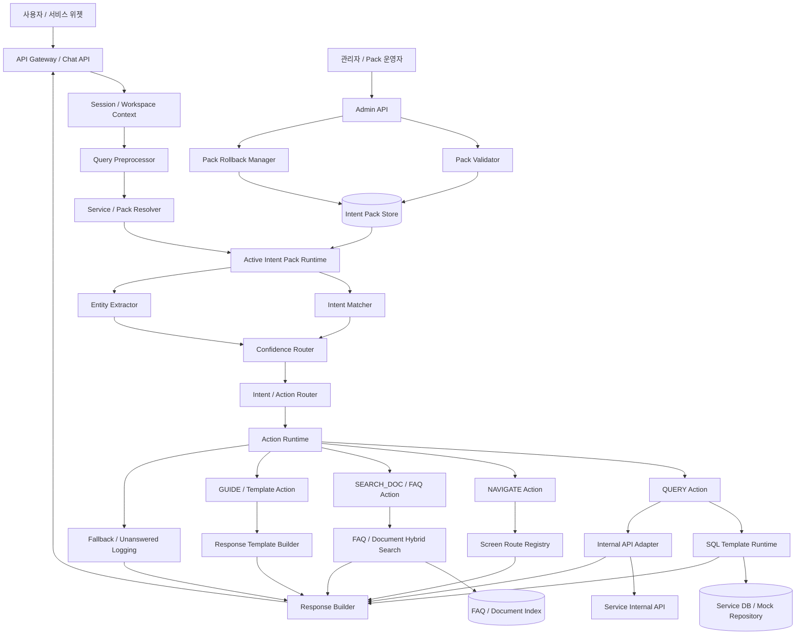
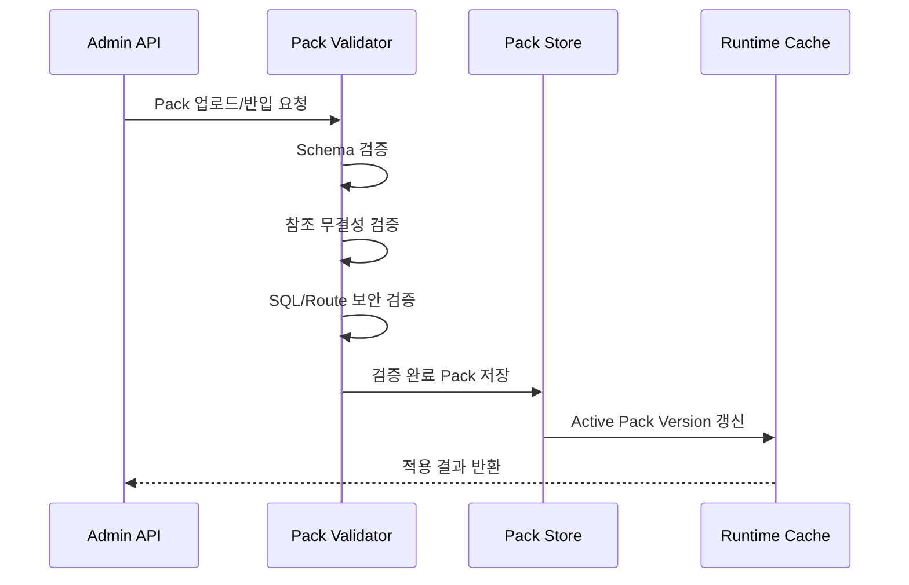

# 03. 공통 NLU/Action 아키텍처 정의서

## 1. 문서 개요
| 항목 | 내용 |
|---|---|
| 문서명 | 공통 NLU/Action 아키텍처 정의서 |
| 작성일 | 2026-06-24 |
| 버전 | v0.1 |
| 작성 관점 | TA/아키텍트 |
| 목적 | 폐쇄망 대응형 Lightweight NLU + Action 플랫폼의 목표 아키텍처와 주요 컴포넌트, 처리 흐름, 확장 구조 정의 |
| 기준 문서 | 13_프로젝트목표_및_1차범위정의서.md, 12_WBS_및_수행계획.md, 12_Intent_Pack_표준정의서.md, 14_Intent_Pack_JSON_Schema_초안.md |

---

## 2. 아키텍처 목표

본 아키텍처는 외부 생성형 LLM에 의존하지 않고, 폐쇄망 환경에서 서비스별 업무 질문을 안전하게 Intent/Entity/Action으로 처리하는 공통 플랫폼 구조를 정의한다.

목표는 다음과 같다.

1. 여러 서비스가 하나의 공통 NLU/Action Runtime을 재사용한다.
2. 서비스별 업무 정의는 Intent Pack으로 분리하여 독립 배포/롤백한다.
3. 사용자 질문은 Query Preprocessor, Intent Matcher, Entity Extractor, Confidence Router를 거쳐 처리한다.
4. Action 실행은 Action Registry에 등록된 승인 Action만 허용한다.
5. 데이터 조회는 SQL Template 또는 내부 API 기반으로 제한한다.
6. 문서/FAQ 질문은 Knowledge Search 또는 Template 답변으로 처리한다.
7. Pack Import, Validation, Rollback 구조를 통해 폐쇄망 반입과 운영 안정성을 확보한다.

---

## 3. 전체 아키텍처



---

## 4. Workspace/Service와 Intent Pack Version 구조

### 4.1 개념
기존 Workspace 개념은 유지하되, 실제 업무 서비스 단위와 Intent Pack 적용 단위를 명확히 분리한다.

| 개념 | 설명 | 예시 |
|---|---|---|
| Workspace | 플랫폼 내 논리적 테넌트 또는 프로젝트 단위 | `NETZERO`, `ADS`, `LIMIT` |
| Service | 챗봇이 붙는 업무 서비스 | 탄소중립플랫폼, 광고 플랫폼, 한도 관리 시스템 |
| Intent Pack | 서비스별 Intent/Entity/Action/Route/Validation 묶음 | `netzero-intent-pack` |
| Pack Version | 운영 반영 가능한 Pack 버전 | `0.1.0`, `0.2.0` |
| Active Pack | 현재 서비스에 적용 중인 Pack Version | `NETZERO` → `0.1.0` |

### 4.2 결합 구조
```text
workspace/service
 ├─ active_pack_version
 ├─ pack_versions
 │  ├─ 0.1.0
 │  ├─ 0.2.0
 │  └─ rollback_target
 ├─ knowledge_index_version
 ├─ screen_route_version
 └─ action_policy_version
```

### 4.3 적용 원칙
| 원칙 | 설명 |
|---|---|
| 서비스별 격리 | Intent Pack은 `service_id` 기준으로 격리한다. |
| 버전 단위 배포 | Pack 적용은 파일 단위가 아니라 Pack Version 단위로 수행한다. |
| 활성 버전 단일화 | 서비스별 Active Pack은 한 번에 하나만 둔다. |
| 빠른 롤백 | 신규 Pack 장애 시 직전 정상 버전으로 즉시 되돌린다. |
| 실행 시점 고정 | 사용자의 요청은 요청 시작 시점의 Active Pack Version으로 처리한다. |

---

## 5. 주요 컴포넌트

### 5.1 Query Preprocessor
사용자 질문을 NLU 처리에 적합한 형태로 정규화한다.

| 기능 | 설명 |
|---|---|
| 공백/특수문자 정리 | 반복 공백, 불필요한 특수문자 제거 |
| 대소문자/표기 정규화 | `Scope1`, `scope 1`, `스코프1` 등 표준화 전처리 |
| 날짜 표현 정규화 | 오늘, 이번 달, 작년, 1분기 등 기간 후보 추출 |
| 불용어 처리 | 알려줘, 보여줘, 어디야 등 명령형 표현 분리 |
| 원문 보존 | 감사 로그와 미응답 등록을 위해 원문은 별도 보존 |

### 5.2 Service / Pack Resolver
요청의 `workspace_id` 또는 `service_id`를 기준으로 적용할 Active Intent Pack을 결정한다.

| 입력 | 출력 |
|---|---|
| `workspace_id`, `service_id`, user context | `pack_id`, `pack_version`, Pack Runtime Handle |

### 5.3 Intent Matcher
Intent Pack의 `intent_examples.json`과 `intents.json`을 기준으로 사용자 질문의 Intent 후보를 반환한다.

1차 PoC에서는 다음 방식을 허용한다.

| 방식 | 설명 | 1차 적용 |
|---|---|:---:|
| Rule/Keyword | 주요 키워드 및 동의어 기반 후보 추출 | O |
| Similarity | 예상 질문과 사용자 질문의 유사도 기반 매칭 | O |
| Hybrid | Rule 후보와 Similarity 점수를 결합 | 권장 |

출력:

```json
{
  "top_intents": [
    {
      "intent_id": "INT-NZ-QUERY-001",
      "score": 0.91,
      "matched_example_id": "EX-NZ-027"
    }
  ]
}
```

### 5.4 Entity Extractor
Intent Pack의 Entity Dictionary와 Synonym을 기준으로 공장, 현장, 기간, Scope, 지표, 메뉴 등 실행에 필요한 값을 추출한다.

| 추출 대상 | 예시 |
|---|---|
| `factory` | A공장, 에이공장, A Factory |
| `site` | B현장, 비현장, B Site |
| `period` | 이번 달, 작년, 2024년, 1분기 |
| `scope` | Scope 1, Scope2, 직접배출 |
| `metric` | 탄소 배출량, 전력 사용량 |
| `menu` | 배출량 입력, 보고서 |

### 5.5 Confidence Router
Intent Matcher의 신뢰도와 Entity 충족 여부를 기준으로 다음 처리 경로를 결정한다.

| 구간 | 기준 | 처리 |
|---|---:|---|
| High | 0.85 이상 | Intent 확정 후 Action 실행 또는 답변 |
| Medium | 0.65 이상 | 후보 Intent 제시 또는 필수 Entity 확인 |
| Low | 0.45 이상 | 문서/FAQ Fallback |
| Very Low | 0.45 미만 | 미응답 질문 등록 |

조회/다운로드 등 업무 영향이 있는 Action은 High라도 사용자 확인 단계를 둔다.

### 5.6 Intent / Action Router
확정된 Intent의 `action_id`를 기준으로 Action Runtime을 호출한다.

| Intent 유형 | 라우팅 대상 |
|---|---|
| `query` | Query Action |
| `navigate` | Navigation Action |
| `search_doc` | Document/FAQ Search |
| `guide` | Guide Template |
| `error_help` | Error Help Template |
| `fallback` | Unanswered Logging |

### 5.7 Action Runtime
Action Registry에 등록된 Action만 실행한다.

| Action Type | 실행 방식 | 설명 |
|---|---|---|
| QUERY | SQL Template, Internal API, Mock | 데이터 조회 |
| DOWNLOAD | Internal API | 파일 다운로드. 1차는 보류 |
| NAVIGATE | Route Registry | 화면 이동 정보 반환 |
| SEARCH_DOC | Knowledge Search | 문서/FAQ 검색 |
| GUIDE | Template | 절차 안내 |
| CREATE_REQUEST | Internal API/Logging | 미응답 질문 등록 |

### 5.8 SQL Template Runtime
자연어 SQL 생성은 금지하며, 승인된 SQL Template만 실행한다.

| 보안 원칙 | 설명 |
|---|---|
| SQL Allowlist | 등록된 Template만 실행 |
| Parameter Binding | `:parameter_name` 바인딩만 허용 |
| Read Only | 1차 PoC에서는 SELECT만 허용 |
| 권한 검증 | 사용자별 공장/현장/조직 범위 검증 |
| 결과 제한 | `max_rows` 적용 |
| 감사 로그 | 실행 Intent, Action, Template, Entity 기록 |

---

## 6. Pack Loader / Validator / Import / Rollback 구조

### 6.1 Pack Loader
Active Pack Version을 런타임에 로드하고 NLU/Action 처리에 필요한 메모리 구조를 생성한다.

```text
Pack Store
 → service_profile.json
 → intents.json
 → intent_examples.json
 → entities.json
 → entity_synonyms.json
 → action_registry.json
 → action_parameters.json
 → sql_templates.json
 → screen_routes.json
 → validation_questions.json
 → Runtime Index 생성
```

### 6.2 Pack Validator
Pack 반입 전 다음 검증을 수행한다.

| 검증 | 설명 |
|---|---|
| Schema 검증 | 파일별 JSON Schema 검증 |
| 참조 무결성 | Intent-Action, Intent-Entity, Action-Parameter 등 참조 확인 |
| SQL 보안 검증 | 금지 키워드, 바인딩, max_rows, 권한 조건 확인 |
| Route 검증 | 폐쇄망 외부 URL 차단 |
| Validation Set 검증 | P0 질문 수와 기대 Intent/Entity 존재 여부 확인 |

### 6.3 Pack Import


### 6.4 Rollback
Rollback Manager는 직전 정상 Active Pack Version을 보관하고, 장애 또는 품질 저하 시 즉시 복구한다.

| 단계 | 설명 |
|---|---|
| 1 | 현재 Active Pack Version 확인 |
| 2 | Rollback Target Version 확인 |
| 3 | Active Pointer를 이전 버전으로 변경 |
| 4 | Runtime Cache 재로딩 |
| 5 | Rollback Audit Log 저장 |

---

## 7. 탄소중립 PoC 처리 흐름

### 7.1 조회형 질문
```text
질문: "A공장 탄소 배출량 알려줘"
 → Query Preprocessor
 → Pack Resolver: NETZERO / netzero-intent-pack / 0.1.0
 → Intent Matcher: INT-NZ-QUERY-001
 → Entity Extractor: factory=A공장, metric=탄소 배출량
 → Confidence Router: High
 → Slot Check: period 누락
 → 사용자 확인 또는 기본 기간 정책 적용
 → Action Router: ACT-NZ-QUERY-EMISSION
 → Mock Query Action
 → Response Builder: 데이터 조회 카드 반환
```

### 7.2 문서/FAQ 질문
```text
질문: "Scope 3 산정 기준이 뭐야?"
 → Intent Matcher: INT-NZ-DOC-002
 → Entity Extractor: scope=Scope 3, topic=산정 기준
 → Action Router: ACT-NZ-SEARCH-SCOPE-GUIDE
 → Knowledge Search 또는 Template Stub
 → Response Builder: 문서 안내 카드 반환
```

### 7.3 화면 이동 질문
```text
질문: "배출량 입력 어디서 해?"
 → Intent Matcher: INT-NZ-NAV-001
 → Entity Extractor: menu=배출량 입력
 → Action Router: ACT-NZ-GO-EMISSION-INPUT
 → Screen Route Registry
 → Response Builder: 화면 이동 버튼 반환
```

### 7.4 Fallback 질문
```text
질문: "다음 달 배출량을 예측해줘"
 → Intent Matcher: Low 또는 범위 외 Intent
 → Confidence Router: Fallback
 → Unanswered Logging
 → Response Builder: 답변 보완 필요 카드 반환
```

---

## 8. 데이터 저장소 구성

### 8.1 1차 PoC 저장소
| 저장소 | 용도 | 1차 방식 |
|---|---|---|
| Pack Store | Intent Pack JSON 저장 | 파일 기반 또는 DB Stub |
| Runtime Cache | Active Pack 메모리 로드 | In-memory |
| Mock Repository | 조회형 Action Mock 결과 | 정적 JSON 또는 코드 Stub |
| Log Store | 매칭/Action/Fallback 로그 | 파일 또는 DB Stub |
| Knowledge Index | 문서/FAQ 검색 Stub | 정적 FAQ/Template |

### 8.2 운영 확장 저장소
| 저장소 | 용도 |
|---|---|
| PostgreSQL | Pack Metadata, Version, Audit, Logs |
| Object/File Store | Pack 원본 파일, 반입 패키지 |
| Vector/Keyword Index | FAQ/문서 검색 |
| Service DB/API | 실제 업무 데이터 조회 |

---

## 9. API 경계

### 9.1 Chat API
| API | 설명 |
|---|---|
| `POST /api/v1/workspaces/{workspace_id}/chat` | 사용자 질문 처리 |
| `POST /api/v1/workspaces/{workspace_id}/nlu/test` | Intent/Entity 매칭 테스트 |

### 9.2 Pack Admin API
| API | 설명 |
|---|---|
| `POST /api/v1/workspaces/{workspace_id}/intent-packs/import` | Pack 반입 |
| `POST /api/v1/workspaces/{workspace_id}/intent-packs/validate` | Pack 검증 |
| `GET /api/v1/workspaces/{workspace_id}/intent-packs` | Pack 목록 조회 |
| `POST /api/v1/workspaces/{workspace_id}/intent-packs/{version}/activate` | Pack 활성화 |
| `POST /api/v1/workspaces/{workspace_id}/intent-packs/rollback` | 이전 버전 롤백 |

### 9.3 Action Test API
| API | 설명 |
|---|---|
| `POST /api/v1/workspaces/{workspace_id}/actions/test` | Action 실행 테스트 |
| `GET /api/v1/workspaces/{workspace_id}/actions` | Action Registry 조회 |

---

## 10. 보안 아키텍처

| 영역 | 보안 기준 |
|---|---|
| 외부 통신 | 외부 LLM/API 호출 금지 |
| Pack 반입 | Manifest, Checksum, Signature 검증 |
| Pack 적용 | 검증 완료 Pack만 Active 가능 |
| Action 실행 | Action Registry 등록 Action만 실행 |
| SQL 실행 | SQL Template Allowlist와 Parameter Binding 필수 |
| 권한 검증 | Action 실행 전 사용자/서비스/데이터 권한 확인 |
| 로그 | 질문 원문, Entity, Action, 결과는 마스킹 정책 적용 |
| 화면 이동 | 외부 URL 차단, 내부 Route만 허용 |

---

## 11. 확장 구조

### 11.1 광고 플랫폼 확장
광고 플랫폼은 동일 Runtime을 사용하고 별도 Intent Pack만 추가한다.

| 구분 | 예시 |
|---|---|
| Service ID | `ADS` |
| Intent 예시 | 캠페인 성과 조회, 광고비 소진 현황, 소재 심사 상태 |
| Entity 예시 | campaign, advertiser, period, metric, media_type |
| Action 예시 | QUERY_CAMPAIGN_PERFORMANCE, GO_CAMPAIGN_REPORT |

### 11.2 한도 관리 시스템 확장
| 구분 | 예시 |
|---|---|
| Service ID | `LIMIT` |
| Intent 예시 | 고객 한도 조회, 한도 변경 요청 상태, 승인 이력 조회 |
| Entity 예시 | customer, limit_type, period, approval_status |
| Action 예시 | QUERY_LIMIT, QUERY_APPROVAL_STATUS, GO_LIMIT_REQUEST |

### 11.3 확장 절차
```text
1. 신규 Service Profile 작성
2. 서비스별 Intent/Entity/Action 정의
3. Intent Examples와 Validation Questions 작성
4. JSON Schema 검증
5. Pack 단위 참조 무결성 검증
6. PoC 질문셋 테스트
7. Active Pack 반영
```

---

## 12. 1차 PoC 완료 기준

| 항목 | 기준 |
|---|---|
| Pack 로딩 | NETZERO Intent Pack v0.1 로드 가능 |
| Intent 매칭 | Validation Questions 기준 Top-1 80% 이상 |
| Entity 추출 | 주요 Entity 추출 정확도 85% 이상 |
| Confidence 분기 | High/Medium/Low/Fallback 처리 가능 |
| Action 라우팅 | Search/Navigate/Query Mock/Fallback 분기 가능 |
| Mock 응답 | 배출량, 전력 사용량, 미입력 현황 Mock 응답 가능 |
| 미응답 기록 | Fallback 질문 기록 가능 |
| 확장성 | ADS/LIMIT 서비스 Pack 추가 구조 설명 가능 |

---

## 13. 후속 작업

| 순서 | 작업 | 담당 |
|---:|---|---|
| 1 | Intent Matcher PoC 방식 결정 및 설계 | AI Engineer |
| 2 | Pack Loader/Validator 개발 착수 | Backend |
| 3 | Entity Extractor 규칙 정의 | AI Engineer, BA |
| 4 | Action Runtime 인터페이스 상세화 | Backend |
| 5 | 테스트 시나리오 작성 | QA |
| 6 | 답변 카드 UI 정의 | Frontend |
