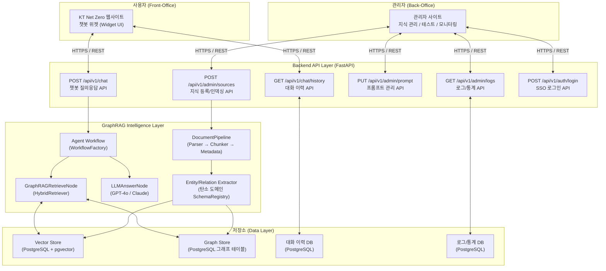

# 탄소 중립플랫폼 챗봇 시스템 아키텍처 정의서

## 1. 문서 개요

| 항목 | 내용 |
| --- | --- |
| 문서명 | 탄소 중립플랫폼 챗봇 시스템 아키텍처 정의서 |
| 버전 | v0.1 |
| 작성일 | 2026-06-22 |
| 작성자 | PM / Architect |
| 참조 문서 | 탄소중립챗봇_프로젝트계획서.md |

---

## 2. 시스템 개요

본 시스템은 `ktnetzero.kt.co.kr` 플랫폼 위에 **GraphRAG 기반 지능형 챗봇**을 통합하는 구조입니다. 사용자는 탄소 중립 관련 전문 지식을 자연어로 질의하고, 출처(Evidence)가 포함된 신뢰도 높은 답변을 받습니다. 관리자는 별도 Back-Office에서 지식 데이터(Source)를 등록·관리하고 챗봇 운영 현황을 모니터링합니다.

---

## 3. 전체 시스템 구성도

---

## 4. 계층별 주요 컴포넌트

### 4.1 Presentation Layer (프론트엔드)

| 컴포넌트 | 설명 | 기술 |
| --- | --- | --- |
| 챗봇 위젯 (Widget) | KT Net Zero 기존 사이트에 삽입되는 챗봇 UI | JavaScript (Vanilla JS 또는 Vue 컴포넌트) |
| 관리자 웹사이트 | 지식 관리, 인덱싱 실행, 답변 테스트, 로그 조회 | React / Vue (기존 KT Net Zero BO와 동일 스택 검토) |

### 4.2 API Layer (백엔드)

| API | Method | 설명 |
| --- | --- | --- |
| `/api/v1/chat` | POST | 사용자 질문 수신 → GraphRAG 파이프라인 실행 → 답변+출처 반환 |
| `/api/v1/chat/history` | GET | 특정 사용자의 대화 세션 이력 조회 |
| `/api/v1/auth/login` | POST | 구글 SSO 계정 연동 및 JWT 토큰 발급 (RBAC 권한 부여) |
| `/api/v1/admin/sources` | POST / GET | 지식 문서(Source) 등록 및 목록 조회 |
| `/api/v1/admin/sources/{id}/index` | POST | 특정 Source 인덱싱 잡(Job) 실행 |
| `/api/v1/admin/prompt` | GET / PUT | LLM 시스템 프롬프트 조회 및 수정 |
| `/api/v1/admin/logs` | GET | 사용 로그 및 통계 조회 |

### 4.3 Intelligence Layer (GraphRAG 파이프라인)

- **DocumentPipeline**: 탄소 관련 PDF, TXT 파일을 파싱·청킹·정규화
- **SchemaRegistry (carbon_neutral)**: 탄소 도메인 전용 Entity/Relation 정의
- **EntityExtractor / RelationExtractor**: 탄소 전문 용어(법규, 배출권 등) 추출
- **EvidenceLinker**: Chunk-Entity-Relation 연결 및 Evidence 저장
- **HybridRetriever**: Vector 유사도 검색 + Graph 관계 순회 결합 검색
- **ContextAssembler**: 검색 결과를 LLM 입력 Context로 조립
- **LLMAnswerNode**: 시스템 프롬프트 + Context → GPT-4o 호출 → 최종 답변 생성

### 4.4 Data Layer (저장소)

| 저장소 | 용도 | 기술 |
| --- | --- | --- |
| Vector Store | Chunk 임베딩 벡터 저장 및 유사도 검색 | PostgreSQL + pgvector extension |
| Graph Store | Entity, Relation, Evidence 저장 및 그래프 순회 | PostgreSQL (graphrag_entities, graphrag_relations 등) |
| 권한/메뉴 DB | 구글 SSO 연동 계정(RBAC), 권한별 메뉴 관리 | PostgreSQL (sys_roles, admin_users, sys_menus 등) |
| 로그/대화 이력 | 사용자 세션/질의응답 이력 및 챗봇 통계 로그 보관 | PostgreSQL |

---

## 5. 인프라 구성

| 구분 | 사양 (검토 기준) | 비고 |
| --- | --- | --- |
| Web/App 서버 | FastAPI (Python 3.11+) on Linux | uvicorn + nginx |
| DB 서버 | PostgreSQL 15+ with pgvector | pgvector 0.5.0 이상 |
| LLM 연동 | OpenAI API (GPT-4o) | API Key 환경변수 관리 |
| 파일 스토리지 | 로컬 디스크 또는 S3 호환 스토리지 | 업로드 파일 임시 저장 |

---

## 6. 보안 설계

- API 인증: FO 챗봇 API는 JWT 기반, 관리자(BO)는 구글 SSO 연동 및 RBAC 기반 접근 제어(역할/메뉴 분리)
- 환경변수 관리: `.env` 파일 + 프로덕션은 Secrets Manager 사용
- 개인정보: 대화 이력 저장 시 사용자 식별자 최소화 (해시 처리 검토)
- LLM 도메인 제한: 시스템 프롬프트를 통해 탄소 중립 도메인 외 질문 거절 처리

---

## 7. 개발 표준

| 항목 | 기준 |
| --- | --- |
| 언어 | Python 3.11+ |
| 웹 프레임워크 | FastAPI 0.110+ |
| ORM | SQLAlchemy 2.0+ |
| 패키지 관리 | pyproject.toml (setuptools) |
| 테스트 | pytest (단위 + 통합) |
| API 스펙 | OpenAPI 3.0 (FastAPI 자동 생성) |
| 코드 스타일 | PEP8, Black, isort |
| 보안 | 환경변수 기반 Secret 관리, HTTPS 필수 |
