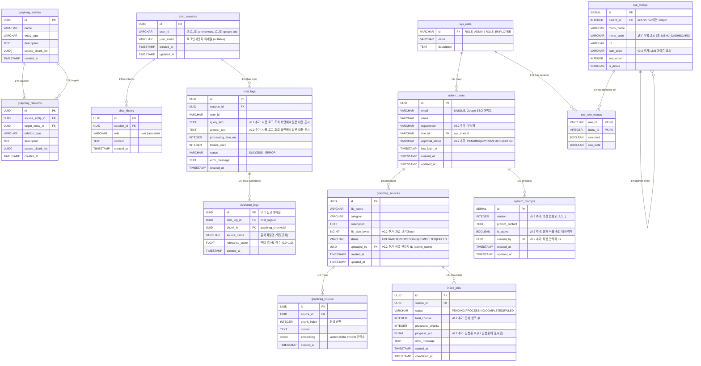

# 탄소 중립플랫폼 챗봇 DB 테이블 및 ERD 설계서

## 1. 문서 개요

| 항목 | 내용 |
| --- | --- |
| 문서명 | 탄소 중립플랫폼 챗봇 DB 테이블 및 ERD 설계서 |
| 대상 DB | `dev.jwinpartners.com:5432` / `vectordb` |
| DB 스키마 | `graphrag` (PostgreSQL 15+ 권한 제약으로 별도 스키마 사용) |
| 작성일 | 2026-06-22 |
| 버전 | v0.2 |
| 변경 이력 | v0.2: 화면 프로토타입 기반 누락 컬럼 및 테이블 추가 반영 (system_prompts 버전관리, admin_users 부서, evidence_logs 신규, graphrag_sources 업로더 등) |

---

## 2. ERD (Entity-Relationship Diagram)

---

## 3. 주요 테이블 명세

### 3.1 `graphrag_sources` (지식 문서 정보)
업로드된 PDF, TXT 등의 원본 문서 파일 정보를 저장합니다.
- **id**: (UUID) 식별자
- **file_name**: (VARCHAR) 원본 파일명
- **category**: (VARCHAR) 문서 분류 (법령/제도, 가이드라인, 사내규정, 보고서)
- **file_size_bytes**: (BIGINT) 파일 크기. BO 지식관리 목록 화면에서 "파일 크기" 컬럼 표시에 사용 `v0.2 추가`
- **status**: (VARCHAR) UPLOADED → PROCESSING → COMPLETED / FAILED 상태 흐름
- **uploaded_by**: (UUID FK → admin_users.id) 업로드한 관리자 계정. 등록자 추적용 `v0.2 추가`

### 3.2 `graphrag_chunks` (문서 파편 및 벡터)
문서를 일정 크기(예: 1000자)로 쪼갠 Chunk 데이터와, 이에 대한 임베딩 벡터를 저장합니다.
- **chunk_index**: (INTEGER) 같은 source 내 청크의 순서 번호
- **embedding**: (`vector(1536)`) OpenAI 임베딩 결과 저장용 (HNSW 인덱스 적용)

### 3.3 `graphrag_entities` (지식 그래프 노드)
LLM이 문서를 분석하여 추출한 탄소중립 관련 엔티티(조직, 기술, 규제 등)를 저장합니다.

### 3.4 `graphrag_relations` (지식 그래프 엣지)
엔티티 간의 관계를 저장하여 GraphRAG 순회 시 문맥 연결성을 제공합니다.

### 3.5 `chat_sessions` & `chat_history` (대화 이력)
사용자의 세션 단위 챗봇 대화 이력을 관리합니다. 비로그인 사용자는 `user_id = 'anonymous'`로 저장됩니다.

### 3.6 `system_prompts` (프롬프트 버전 관리)
관리자(BO)에서 실시간으로 챗봇의 지침을 바꿀 수 있도록 프롬프트를 보관합니다.
- **version**: (INTEGER) 저장 시마다 자동 증가. BO 프롬프트 편집기의 버전 탭(v1, v2, v3...)에 대응 `v0.2 추가`
- **is_active**: (BOOLEAN) 현재 챗봇에 적용 중인 버전. 저장 시 기존 active를 false로 변경 후 신규 active=true 설정 `v0.2 추가`
- **created_by**: (UUID FK → admin_users.id) 해당 프롬프트를 저장한 관리자 `v0.2 추가`

### 3.7 `sys_roles`, `sys_menus`, `sys_role_menus` (권한 및 메뉴 관리)
RBAC(Role-Based Access Control) 기반 테이블로, BO 권한관리 화면에서 직접 운영됩니다.
- **sys_roles**: `ROLE_ADMIN`, `ROLE_EMPLOYEE` 등 역할 그룹 정의
- **sys_menus**: LNB 메뉴의 계층 구조(1depth/2depth), 아이콘, URL, 정렬 순서 정의. `menu_code`, `icon_code` 컬럼 추가 `v0.2`
- **sys_role_menus**: 역할별 메뉴 조회(can_read) / 수정(can_write) 권한 매핑. BO 메뉴-권한 매핑 화면의 체크박스가 이 테이블 데이터를 제어

### 3.8 `admin_users` (관리자 계정)
구글 SSO를 거쳐 접속한 관리자의 권한 및 접속 기록을 관리합니다.
- **email**: (VARCHAR) 구글 연동 이메일 주소 (식별키 역할)
- **department**: (VARCHAR) 부서명. BO 계정 목록 화면에서 "부서" 컬럼 표시용 `v0.2 추가`
- **approval_status**: (VARCHAR) `PENDING`(최초 SSO 가입) → `APPROVED`(관리자 승인) / `REJECTED`. BO 계정 목록 화면의 "미승인" 상태 행과 대응 `v0.2 추가`
- **role_id**: (VARCHAR) 부여된 권한 그룹 ID. 관리자가 직접 변경하는 Role 드롭다운과 대응

### 3.9 `index_jobs` (지식 인덱싱 작업 이력)
대용량 문서의 청킹, 벡터 임베딩 및 그래프 추출 작업 상태를 추적합니다.
- **total_chunks**: (INTEGER) 파싱 후 산출된 전체 청크 수 `v0.2 추가`
- **progress_pct**: (FLOAT) 처리율(%). BO 지식관리 목록의 **진행률 바(Progress Bar) UI**와 직접 매핑 `v0.2 추가`

### 3.10 `chat_logs` (챗봇 통계/성능 로그)
모든 챗봇 질의응답의 응답 속도, 토큰, 처리 결과를 기록합니다.
- **query_text**: (TEXT) 사용자 질문 원문. BO 사용 로그 조회 화면에서 질문 내용 표시에 사용 `v0.2 추가`
- **answer_text**: (TEXT) 챗봇 답변 원문. BO 사용 로그 조회 화면에서 답변 내용 표시에 사용 `v0.2 추가`

### 3.11 `evidence_logs` (답변 출처 로그) `v0.2 신규`
챗봇 답변의 근거로 활용된 문서 청크 정보를 저장합니다. FO 챗봇 위젯의 **출처(Evidence) 칩** 표시와 직접 대응합니다.
- **chat_log_id**: (UUID FK → chat_logs.id) 어느 답변에 사용된 근거인지 연결
- **chunk_id**: (UUID FK → graphrag_chunks.id) 실제 사용된 청크
- **source_name**: (VARCHAR) 출처 파일명 역정규화 저장 (JOIN 없이 빠른 조회)
- **relevance_score**: (FLOAT) 벡터 유사도 점수 (FO 화면의 "96%" 등 표시용)

---

## 4. 인덱스 최적화 내역

| 대상 테이블/컬럼 | 인덱스 방식 | 목적 |
| --- | --- | --- |
| `graphrag_chunks.embedding` | HNSW (pgvector) | 코사인 유사도 검색 최적화 |
| `graphrag_entities.name` | B-Tree | 엔티티명 Exact/Like 검색 |
| `graphrag_relations(source_entity_id, target_entity_id)` | B-Tree (복합) | 그래프 순회 가속 |
| `chat_history.session_id` | B-Tree | 세션별 대화내역 조회 최적화 |
| `chat_logs.created_at` | B-Tree | 대시보드 일별 통계 집계 최적화 `v0.2 추가` |
| `evidence_logs.chat_log_id` | B-Tree | 답변별 출처 청크 조회 최적화 `v0.2 추가` |
| `admin_users.approval_status` | B-Tree | 미승인 계정 필터 조회 최적화 `v0.2 추가` |
| `system_prompts.is_active` | B-Tree (Partial) | 현재 적용 프롬프트 단건 조회 최적화 `v0.2 추가` |
