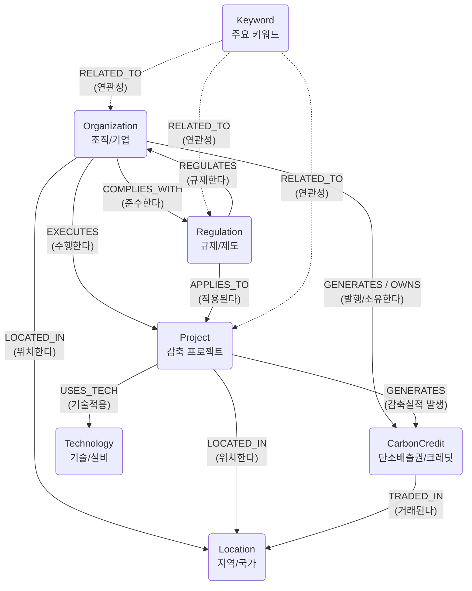

# 탄소 중립플랫폼 챗봇 도메인 정의서 (Entity & Relation 모델링)

## 1. 문서 개요

| 항목 | 내용 |
| --- | --- |
| 문서명 | 탄소 중립플랫폼 챗봇 도메인 정의서 |
| 목적 | GraphRAG 엔진이 텍스트에서 추출할 탄소 중립 관련 핵심 지식 구조(Schema) 정의 |
| 버전 | v0.1 |
| 작성일 | 2026-06-22 |
| 작성자 | 분석/설계 담당자 |
| 참조 문서 | 요구사항정의서, 시스템아키텍처정의서 |

---

## 2. GraphRAG 스키마 구조 개요

GraphRAG 파이프라인에서 문서를 처리할 때, 아래 정의된 엔티티(Entity)와 관계(Relation) 스키마를 프롬프트에 주입하여 LLM이 문서 구조화를 수행하도록 유도합니다.

---

## 3. 엔티티(Entity) 정의

탄소 중립 문서(PDF, 법규, 사업계획서 등)에서 추출해야 할 핵심 명사 객체입니다.

| 엔티티 타입 (Type) | 한글명 | 설명 | 추출 예시 |
| --- | --- | --- | --- |
| **`Organization`** | 조직/기업 | 탄소 감축 의무 대상 기업, 인증 기관, 정부 부처 등 | 환경부, KT, 배출권거래소, 유엔기후변화협약(UNFCCC) |
| **`Regulation`** | 규제/제도 | 탄소 배출 관련 법령, 협약, 제도, 지침명 | 배출권거래제(K-ETS), 파리기후협약, RE100, 탄소국경조정제도(CBAM) |
| **`CarbonCredit`** | 배출권/크레딧 | 배출권 단위, 감축 실적, 인증서 종류 | KAU(할당배출권), KOC(외부사업감축실적), CER, REC |
| **`Project`** | 프로젝트/사업 | 기업이 수행하는 탄소 감축 및 상쇄 활동 명칭 | 태양광 발전 구축 사업, 조림 사업, 고효율 설비 교체 |
| **`Technology`** | 기술/설비 | 탄소 감축에 사용되는 핵심 기술, 장비, 에너지원 | CCUS(탄소포집), 해상풍력, 히트펌프, 수소환원제철 |
| **`Location`** | 국가/지역 | 제도나 프로젝트가 적용/위치하는 지리적 공간 | 대한민국, EU, 아프리카 가나, 제주도 |
| **`Keyword`** | 핵심 키워드 | 탄소 중립과 관련된 주요 전문 용어나 트렌드 키워드 | 탄소중립, Scope 3, 탄소발자국, ESG, 넷제로(Net Zero) |

---

## 4. 관계(Relation) 정의

추출된 엔티티 간의 의미적 연결성(동사형)을 정의합니다. 지식 그래프 순회 시 문맥을 파악하는 핵심 요소입니다.

| 관계명 (Relation) | 설명 (A가 B를...) | 출발 엔티티 (A) | 도착 엔티티 (B) | 관계 예시 문장 |
| --- | --- | --- | --- | --- |
| **`COMPLIES_WITH`** | ~을 준수한다, 따른다 | `Organization` | `Regulation` | **KT**(Org)는 **배출권거래제**(Reg)를 준수해야 한다. |
| **`REGULATES`** | ~을 규제/관리한다 | `Regulation` | `Organization` | **환경부**(Org)가 **배출권거래제**(Reg)를 총괄한다. |
| **`EXECUTES`** | ~사업을 수행/주관한다 | `Organization` | `Project` | **KT**(Org)가 **태양광 구축 사업**(Proj)을 진행한다. |
| **`GENERATES`** | ~을 발생/생성시킨다 | `Project`, `Organization` | `CarbonCredit` | **조림 사업**(Proj)으로 **KOC**(Credit)를 확보했다. |
| **`OWNS`** | ~을 보유/소유한다 | `Organization` | `CarbonCredit` | **A기업**(Org)은 10만톤의 **KAU**(Credit)를 보유 중이다. |
| **`APPLIES_TO`** | ~에 적용된다 | `Regulation` | `Project`, `Technology` | **K-ETS**(Reg)는 **CCUS 기술**(Tech) 실적을 인정한다. |
| **`USES_TECH`** | ~기술/설비를 사용한다 | `Project`, `Organization` | `Technology` | 이 **프로젝트**(Proj)는 **고효율 히트펌프**(Tech)를 쓴다. |
| **`LOCATED_IN`** | ~에 위치/적용된다 | `Organization`, `Project` | `Location` | 해당 **조림 사업**(Proj)은 **인도네시아**(Loc)에서 진행된다. |
| **`RELATED_TO`** | ~와 연관이 있다 | (모든 엔티티) | (모든 엔티티) | (기타 논리적 연관성이 있는 경우 범용적으로 사용) |

---

## 5. 속성(Attribute) 스키마

지식 그래프를 구성하는 각 노드(Entity)와 엣지(Relation)에 저장될 메타데이터 구조입니다. 이는 향후 PostgreSQL `graphrag_entities`, `graphrag_relations` 테이블의 구조와 매핑됩니다.

### 5.1 Entity 속성
- `id` (UUID) : 엔티티 고유 식별자
- `name` (String) : 엔티티 정규화 명칭 (예: "배출권거래제")
- `type` (String) : 엔티티 타입 (예: "Regulation")
- `description` (Text) : LLM이 요약한 엔티티의 종합 설명
- `source_docs` (List) : 이 엔티티가 추출된 원본 Chunk ID 목록

### 5.2 Relation 속성
- `id` (UUID) : 관계 고유 식별자
- `source_entity_id` (UUID) : 출발 엔티티 ID
- `target_entity_id` (UUID) : 도착 엔티티 ID
- `relation_type` (String) : 관계명 (예: "COMPLIES_WITH")
- `description` (Text) : 관계를 설명하는 구체적인 문장 (예: "KT는 2015년부터 K-ETS 대상 기업으로 지정됨")
- `source_docs` (List) : 이 관계가 추출된 원본 Chunk ID 목록

---

## 6. 개발 적용 방안 (Next Steps)

1. **SchemaRegistry 설정**
   - 본 문서의 Entity/Relation 목록을 `GraphRAG-AI-Agent` 내의 `src/common_core/parser/schema_registry.py` 또는 커스텀 모듈에 적용합니다.
2. **LLM Extraction 프롬프트 반영**
   - 위 목록을 JSON/YAML 포맷으로 변환하여 지식 추출 단계의 `System Prompt`에 삽입합니다.
   - LLM이 임의의 노드를 생성하지 않도록 추출 범위를 위 목록으로 제한(Constrained Extraction)합니다.
