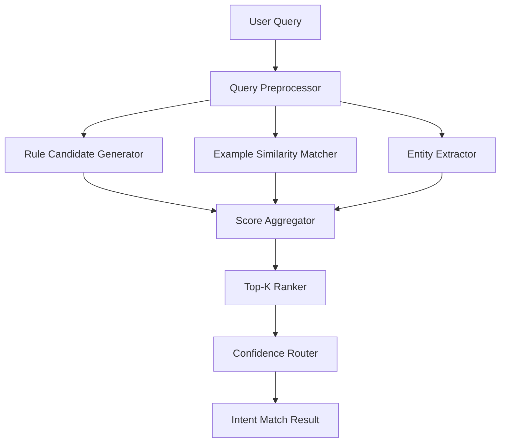

# 15. Intent Matcher PoC 설계서

## 1. 문서 개요
| 항목 | 내용 |
|---|---|
| 문서명 | Intent Matcher PoC 설계서 |
| 작성일 | 2026-06-24 |
| 버전 | v0.1 |
| 작성 관점 | AI Engineer |
| 목적 | 탄소중립플랫폼 Intent Pack v0.1과 표준 질문셋 v0.2를 기준으로 1차 PoC에 적용할 Intent Matcher 방식을 결정하고 설계 |
| 기준 문서 | 03_공통_NLU_Action_아키텍처정의서.md, 13_탄소중립플랫폼_Intent_Pack_v0.1.md, 15_탄소중립_표준질문셋_v0.2.md |

---

## 2. PoC 목표

1차 PoC의 Intent Matcher는 외부 LLM 또는 외부 임베딩 API 없이 사용자 질문의 Intent 후보를 산출해야 한다.

목표는 다음과 같다.

1. 탄소중립 표준 질문셋 v0.2의 질문 50개를 대상으로 Intent Top-1/Top-3 후보를 반환한다.
2. Rule 기반 키워드/동의어 매칭과 예시 질문 유사도 매칭을 결합한다.
3. Entity Extractor 결과를 점수 보정에 활용한다.
4. Confidence Router가 사용할 수 있는 정규화된 점수와 판단 근거를 제공한다.
5. 향후 로컬 임베딩 모델 또는 형태소 분석기를 추가해도 인터페이스 변경이 최소화되도록 설계한다.

---

## 3. 방식 비교

| 방식 | 설명 | 장점 | 단점 | 1차 PoC 판단 |
|---|---|---|---|---|
| Rule 기반 매칭 | Intent별 키워드, Entity, 동의어 규칙으로 후보 산출 | 구현 빠름, 설명 가능, 폐쇄망 적합 | 표현 다양성에 약함 | 단독 사용은 제한 |
| 유사도 기반 매칭 | 사용자 질문과 Intent 예시 질문 간 문자열/토큰 유사도 계산 | 질문 표현 변화에 대응 | 의미 유사도 한계, 짧은 문장 오탐 가능 | 보조 랭킹으로 적합 |
| 로컬 임베딩 기반 매칭 | 로컬 임베딩 모델로 질문 벡터 유사도 계산 | 의미 유사도 우수 | 모델 반입/검증 필요 | 2차 고도화 후보 |
| Hybrid 매칭 | Rule 후보 + 유사도 점수 + Entity 보정 결합 | 설명 가능성과 유연성 균형 | 점수 튜닝 필요 | 1차 PoC 권장 |

## 4. 1차 PoC 결정

1차 PoC는 **Rule 기반 후보 추출 + 토큰 유사도 랭킹 + Entity 보정 점수**를 결합한 Hybrid 방식을 적용한다.

결정 사유는 다음과 같다.

| 사유 | 설명 |
|---|---|
| 폐쇄망 적합성 | 외부 API와 외부 LLM이 필요 없다. |
| 구현 속도 | Python 표준 라이브러리 또는 경량 라이브러리로 구현 가능하다. |
| 설명 가능성 | 어떤 키워드/예시/Entity 때문에 매칭됐는지 근거를 남길 수 있다. |
| 확장성 | 추후 로컬 임베딩 모델 점수를 하나의 scoring feature로 추가 가능하다. |
| PoC 적합성 | 질문셋 50개 기준으로 빠르게 정확도와 실패 유형을 측정할 수 있다. |

---

## 5. 전체 처리 흐름



처리 순서는 다음과 같다.

1. 사용자 질문 원문을 보존한다.
2. Query Preprocessor가 정규화 텍스트와 토큰을 생성한다.
3. Entity Extractor가 공장, 현장, 기간, Scope, 지표, 메뉴 등을 추출한다.
4. Rule Candidate Generator가 키워드/동의어 기반 후보 Intent를 산출한다.
5. Example Similarity Matcher가 모든 예시 질문과 유사도를 계산한다.
6. Score Aggregator가 Rule 점수, 유사도 점수, Entity 보정 점수를 결합한다.
7. Top-K Ranker가 Top-1/Top-3 후보를 반환한다.
8. Confidence Router가 High/Medium/Low/Very Low를 판단한다.

---

## 6. 입력/출력 인터페이스

### 6.1 입력
```json
{
  "service_id": "NETZERO",
  "pack_version": "0.1.0",
  "query": "A공장 탄소 배출량 알려줘",
  "user_context": {
    "user_id": "mock-user",
    "roles": ["data_viewer"],
    "workspace_id": "NETZERO"
  }
}
```

### 6.2 출력
```json
{
  "query": "A공장 탄소 배출량 알려줘",
  "normalized_query": "A공장 탄소 배출량",
  "top_intents": [
    {
      "intent_id": "INT-NZ-QUERY-001",
      "intent_name": "공장별 탄소 배출량 조회",
      "score": 0.91,
      "confidence_level": "HIGH",
      "matched_features": {
        "rule_score": 0.95,
        "similarity_score": 0.88,
        "entity_score": 0.90,
        "matched_examples": ["A공장 탄소 배출량 알려줘"],
        "matched_entities": {
          "factory": "A공장",
          "metric": "탄소 배출량"
        }
      }
    }
  ],
  "selected_intent_id": "INT-NZ-QUERY-001",
  "route_hint": "query_mock_action"
}
```

---

## 7. Query Preprocessing

### 7.1 정규화 규칙
| 규칙 | 예시 |
|---|---|
| 공백 정리 | `Scope  1` → `Scope 1` |
| 영문 대소문자 정규화 | `scope1` → `Scope 1` |
| 한글 동의어 보존 | `에이공장`은 Entity Synonym에서 처리 |
| 명령형 불용어 분리 | 알려줘, 보여줘, 어디야, 열어줘 |
| 특수문자 제거 | 물음표, 마침표 등 제거 |

### 7.2 토큰 생성
1차 PoC는 형태소 분석기 없이 공백/문자 n-gram 기반 토큰을 사용한다.

| 토큰 유형 | 설명 |
|---|---|
| Word Token | 공백 기준 단어 |
| Char Bigram | 2글자 단위 문자 조각 |
| Protected Token | Scope 1, tCO2e, RE100 등 보호 토큰 |

---

## 8. Rule Candidate Generator

### 8.1 Rule Source
Rule은 Intent Pack에서 파생한다.

| Source | 활용 방식 |
|---|---|
| `intents.json` | Intent category, required_entities, action_id |
| `intent_examples.json` | Intent별 대표 표현 |
| `entities.json` | Entity Type |
| `entity_synonyms.json` | 표준값/동의어 |
| `action_registry.json` | Action Type |

### 8.2 Rule 예시
| 조건 | 후보 Intent |
|---|---|
| `배출량`, `공장`, `조회/알려줘/보여줘` 포함 | INT-NZ-QUERY-001 |
| `전력/전기/전력량`, `사용량` 포함 | INT-NZ-QUERY-002 |
| `미입력/누락/아직 입력 안` 포함 | INT-NZ-QUERY-003 |
| `Scope 1/2/3`, `기준/산정` 포함 | INT-NZ-DOC-002 |
| `어디/메뉴/화면/이동/열어줘` 포함 | INT-NZ-NAV-001 또는 INT-NZ-NAV-002 |
| `권한 없음/접근 불가/안 보여` 포함 | INT-NZ-ERR-001 |

### 8.3 Rule Score
```text
rule_score = min(1.0, keyword_score + entity_hint_score + action_verb_score)
```

| Feature | 점수 |
|---|---:|
| 핵심 업무 키워드 매칭 | 0.30 |
| Entity Type 힌트 매칭 | 0.30 |
| Action Verb 매칭 | 0.20 |
| Intent Category 힌트 매칭 | 0.20 |

---

## 9. Example Similarity Matcher

### 9.1 유사도 방식
1차 PoC는 외부 모델 없이 다음 유사도 중 하나 또는 조합을 사용한다.

| 방식 | 설명 | 적용 |
|---|---|:---:|
| Token Jaccard | 사용자 질문 토큰과 예시 질문 토큰의 교집합/합집합 | O |
| Char Bigram Jaccard | 문자 bigram 기반 유사도 | O |
| Sequence Ratio | 문자열 시퀀스 유사도 | 선택 |

### 9.2 Similarity Score
```text
similarity_score =
  0.50 * token_jaccard
+ 0.35 * char_bigram_jaccard
+ 0.15 * sequence_ratio
```

예시 질문 단위로 점수를 계산한 뒤, Intent별 최고 점수와 평균 상위 점수를 함께 사용한다.

```text
intent_similarity_score =
  0.70 * max_example_score
+ 0.30 * avg_top3_example_score
```

---

## 10. Entity 보정 점수

Entity Extractor 결과는 Intent 점수 보정에 사용한다.

```text
entity_score =
  required_entity_coverage * 0.70
+ optional_entity_coverage * 0.20
+ entity_synonym_match_bonus * 0.10
```

| 항목 | 설명 |
|---|---|
| Required Entity Coverage | Intent 필수 Entity 중 추출된 비율 |
| Optional Entity Coverage | 선택 Entity 중 추출된 비율 |
| Synonym Match Bonus | 동의어 기반 표준값 매칭 성공 보너스 |

필수 Entity가 누락된 경우 Intent 자체를 제거하지 않고 Confidence Router에서 Slot Filling 또는 사용자 확인으로 넘긴다.

---

## 11. 최종 점수 산정

1차 PoC 최종 점수는 다음과 같이 계산한다.

```text
final_score =
  0.40 * rule_score
+ 0.40 * similarity_score
+ 0.20 * entity_score
```

Intent 유형별 보정은 다음과 같다.

| 조건 | 보정 |
|---|---:|
| 질문에 `어디`, `화면`, `메뉴`, `열어줘` 포함 | navigate Intent +0.05 |
| 질문에 `기준`, `산정`, `뭐야`, `뜻` 포함 | search_doc/guide Intent +0.05 |
| 질문에 `조회`, `알려줘`, `보여줘`, `얼마` 포함 | query Intent +0.05 |
| 질문에 `권한`, `접근`, `안 보여`, `실패` 포함 | error_help Intent +0.08 |
| 질문이 예측/세금계산/정책판단 등 1차 범위 외 | fallback 후보 +0.10 |

최종 점수는 0.0~1.0 사이로 clipping한다.

---

## 12. Top-K 후보 반환

| 항목 | 기준 |
|---|---|
| Top-K | 기본 3개 |
| 최소 후보 점수 | 0.30 이상 |
| 동점 처리 | final_score → entity_score → similarity_score → rule_score 순 |
| 후보 다양성 | 같은 Intent Category 후보가 과도하게 몰리면 category별 대표 후보를 유지 |

Top-1과 Top-2 점수 차이가 0.05 이하이면 Medium 이하로 낮춰 사용자 확인을 유도한다.

---

## 13. Confidence Router 연계

| Level | 조건 | 처리 |
|---|---|---|
| HIGH | final_score >= 0.85, Top-1과 Top-2 차이 >= 0.08 | Intent 확정 |
| MEDIUM | final_score >= 0.65 | 후보 Intent 제시 또는 Slot Filling |
| LOW | final_score >= 0.45 | 문서/FAQ Fallback 또는 후보 확인 |
| VERY_LOW | final_score < 0.45 | 미응답 질문 등록 |

Action 유형별 추가 정책:

| Intent Category | 추가 정책 |
|---|---|
| query | HIGH라도 필수 Entity 누락 시 Slot Filling |
| download | HIGH라도 사용자 확인 필수, 1차 PoC는 candidate 처리 |
| navigate | HIGH면 화면 이동 버튼 제공 |
| search_doc | MEDIUM 이상이면 문서/FAQ 검색 허용 |
| fallback | 바로 미응답 질문 등록 |

---

## 14. Entity Extractor 연동 순서

1차 PoC에서는 Entity Extractor를 Intent Matcher 전후로 모두 활용한다.

```text
1. Query Preprocessor
2. 사전 Entity 추출
3. Rule Candidate 생성 시 Entity Hint 활용
4. Similarity 기반 Intent 후보 계산
5. Intent별 required/optional Entity 충족률 계산
6. final_score 보정
7. Confidence Router에서 누락 Entity 처리
```

예시:

| 질문 | 추출 Entity | Intent 영향 |
|---|---|---|
| A공장 탄소 배출량 알려줘 | factory=A공장, metric=탄소 배출량 | INT-NZ-QUERY-001 상승 |
| 배출량 입력 어디서 해? | menu=배출량 입력 | INT-NZ-NAV-001 상승 |
| Scope 3 산정 기준이 뭐야? | scope=Scope 3, topic=산정 기준 | INT-NZ-DOC-002 상승 |

---

## 15. Candidate / Hold / Excluded Intent 처리

| Intent 상태 | Matcher 처리 | Router 처리 |
|---|---|---|
| `mvp` | 정상 후보 | Action 가능 |
| `candidate` | 후보 반환 가능 | Candidate 처리 또는 Fallback |
| `hold` | 낮은 우선순위 후보 | 보류 안내 |
| `excluded` | 기본 후보 제외 | 미응답 또는 제외 안내 |
| `deprecated` | 후보 제외 | 사용 안 함 |

Candidate Intent가 Top-1인 경우 `selected_intent_id`는 유지하되 `route_hint=candidate`로 반환한다.

---

## 16. 테스트 설계

### 16.1 테스트 데이터
| 데이터 | 기준 |
|---|---|
| Intent | 탄소중립 Intent Pack v0.1 |
| 질문셋 | 탄소중립 표준 질문셋 v0.2 50개 |
| Entity | Entity Dictionary 초안 |
| Action | Action Registry 초안 |

### 16.2 테스트 지표
| 지표 | 목표 |
|---|---:|
| Intent Top-1 정확도 | 80% 이상 |
| Intent Top-3 정확도 | 90% 이상 |
| Entity 추출 정확도 | 85% 이상 |
| Fallback 적정 처리율 | 90% 이상 |
| Candidate 처리 정확도 | 80% 이상 |

### 16.3 판정 방식
| 판정 | 기준 |
|---|---|
| Top-1 Correct | Top-1 Intent가 기대 Intent와 일치 |
| Top-3 Correct | Top-3 후보 중 기대 Intent 포함 |
| Entity Correct | 기대 Entity key/value가 추출 결과와 일치 |
| Route Correct | Confidence Router 결과가 기대 처리와 일치 |

---

## 17. 실패 유형 및 보정 전략

| 실패 유형 | 예시 | 보정 |
|---|---|---|
| Query/Navigate 혼동 | "배출량 보고서 화면 보여줘" | 화면/메뉴/이동 키워드 가중치 조정 |
| Doc/Guide 혼동 | "전기 사용량 어떻게 입력해?" | task/menu Entity와 guide Intent 강화 |
| Query/Doc 혼동 | "전력 사용량 배출계수 알려줘" | 배출계수 Entity는 문서 Intent 우선 |
| Entity 누락 | "에이공장" 미인식 | Synonym 추가 |
| Candidate 오실행 | 추이 조회가 Mock Query로 실행 | candidate 상태는 Action 실행 금지 |
| Fallback 미흡 | 예측/세금계산 질문이 Query로 분류 | 범위 외 키워드 룰 추가 |

---

## 18. 구현 모듈 초안

```text
intent_matching/
 ├─ preprocessor.py
 ├─ entity_extractor.py
 ├─ rule_candidate_generator.py
 ├─ similarity_matcher.py
 ├─ score_aggregator.py
 ├─ confidence_router.py
 └─ tests/
    └─ test_netzero_questions.py
```

### 18.1 주요 함수
| 함수 | 설명 |
|---|---|
| `preprocess(query)` | 정규화 텍스트와 토큰 생성 |
| `extract_entities(query, pack)` | Entity Dictionary 기반 Entity 추출 |
| `generate_rule_candidates(query, entities, pack)` | Rule 기반 후보 생성 |
| `score_examples(query, pack)` | 예시 질문 유사도 계산 |
| `aggregate_scores(rule, similarity, entities)` | 최종 점수 산정 |
| `route_confidence(top_intents, entities)` | Confidence Level 산정 |

---

## 19. 2차 고도화 방향

| 고도화 | 설명 |
|---|---|
| 로컬 임베딩 모델 | 폐쇄망 반입 승인된 sentence-transformers 계열 모델 적용 |
| 형태소 분석기 | 한국어 명사/동사 기반 토큰 품질 개선 |
| Intent 추천 | 미응답 질문 로그 기반 신규 Intent 후보 추천 |
| Active Learning | 운영자가 정정한 Intent를 예시 질문에 반영 |
| Reranker | Rule/Embedding 후보를 별도 경량 모델로 재정렬 |

---

## 20. 결론

1차 PoC Intent Matcher는 Hybrid 방식으로 진행한다.

```text
Rule 기반 후보 추출
+ 예시 질문 유사도 랭킹
+ Entity 보정 점수
= 최종 Intent Top-K 후보
```

이 방식은 폐쇄망 제약에 적합하고, 탄소중립 질문셋 50개 기준 PoC를 빠르게 수행할 수 있으며, 향후 로컬 임베딩 모델로 자연스럽게 고도화할 수 있다.
