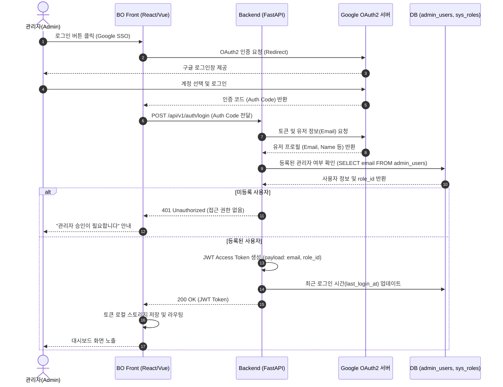
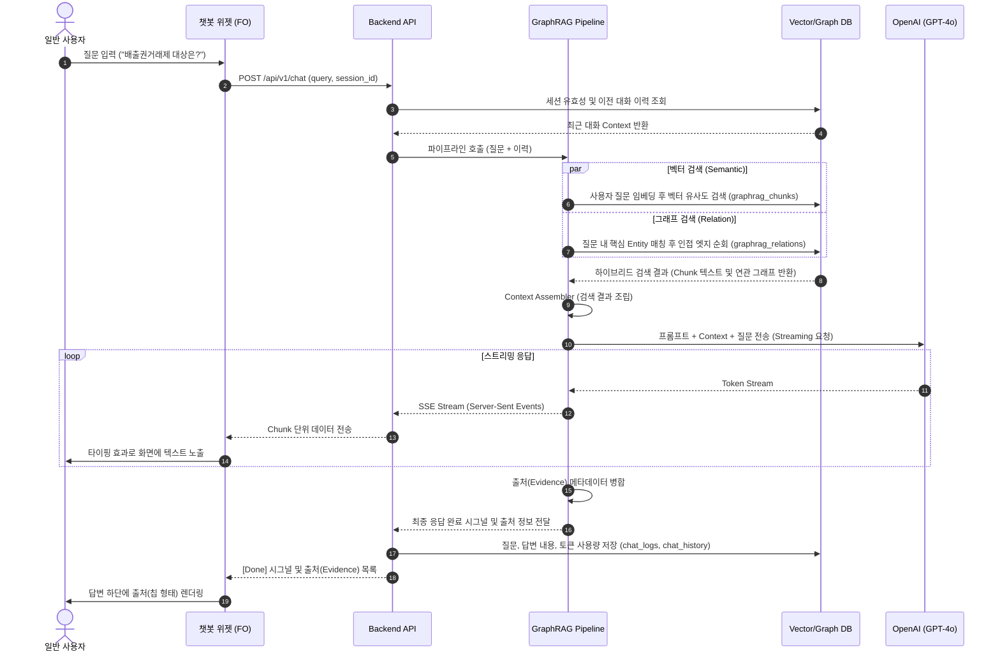
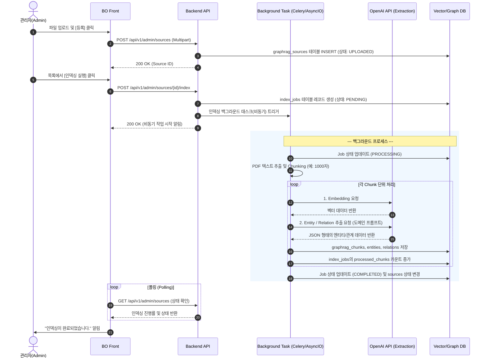

# 탄소 중립플랫폼 프로세스 및 인터페이스 정의서

## 1. 문서 개요

| 항목 | 내용 |
| --- | --- |
| 문서명 | 탄소 중립플랫폼 챗봇 프로세스 및 인터페이스 정의서 |
| 버전 | v0.1 |
| 작성일 | 2026-06-22 |
| 작성자 | 분석/설계 담당자 |
| 목적 | 챗봇 서비스 및 관리자 기능의 내부 모듈 간 상호작용(Sequence) 정의 |

---

## 2. 관리자(BO) 구글 SSO 로그인 프로세스

관리자(Admin) 및 직원(Employee)이 관리자 사이트에 접근하기 위해 구글 SSO 인증을 거치고, 서버로부터 역할(RBAC) 기반 JWT 토큰을 발급받는 과정입니다.

---

## 3. 사용자(FO) 챗봇 질의응답 프로세스 (GraphRAG)

사용자가 챗봇에 자연어로 질문을 입력하고, 백엔드에서 벡터 검색 및 지식 그래프 검색을 융합(Hybrid)하여 LLM 답변을 스트리밍으로 반환하는 흐름입니다.

---

## 4. 관리자(BO) 문서 등록 및 비동기 인덱싱 프로세스

관리자가 방대한 분량의 PDF 문서를 업로드하면 백엔드에서 백그라운드 태스크로 청킹, 임베딩, 그래프 엔티티 추출을 수행하는 흐름입니다.

